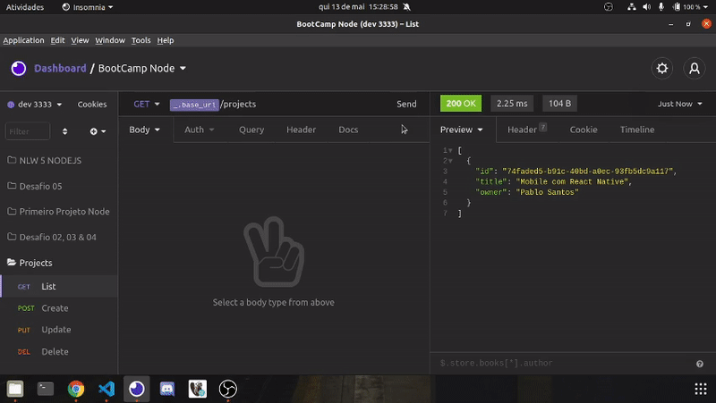

# Anotações de Estudo

- Instalar o nvm para instalar o node em qualquer versão
- Instalar o yarn
- Instalar Estenções:
    - JSON Viewer
    - React Dev Tools
    - OctoTree
- Criar Projeto:
    - yarn init -y
    - mkdir src
    - criar index.js
    - Instalar o Express com Yarn (yarn add express)
    - Instalar o Nodemon com o Yarn (yarn add nodemon -D)
- Executar Projeto (nodemon arquivo.js)
- Instalar o Imsonia
- Métodos HTTP
    - GET (Buscar informações do backend)
    - POST (Criar uma informação no backend)
    - PUT/PATCH (Alterar uma informação no backend)
    - DELETE (deletar alguma informação no backend)
- Imsonia serve para enviar requisições dos mais diversos tipos
- Tipos de Parâmetros:
    - Query Params:
        - Filtros e Paginação
            - ex: url.com/projects?param=x&param2=y
    - Route Params:
        - Indentificar Recursos para atualizar ou deletar
            - ex url.com/projects/1
    - Request Body:
        - Conteudo na hora de criar ou editar um recurso (JSON)
- Middleware
    - Interceptador de requisições que interrompe ou altera dados da requisição
    - função que recebe um requisição que envia uma resposta
  
- yarn add cors (//permite que qualquer frontend que tenha acesso a rota possa se comunicar com o backend)

